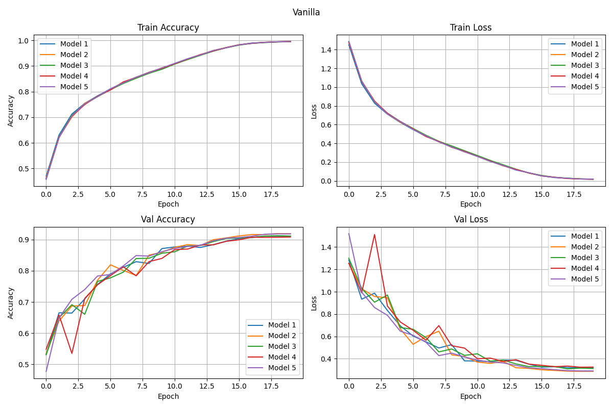
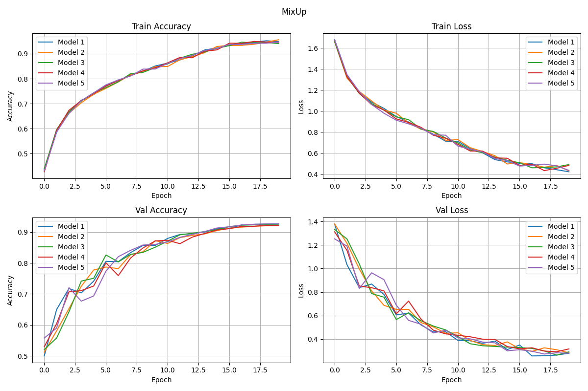
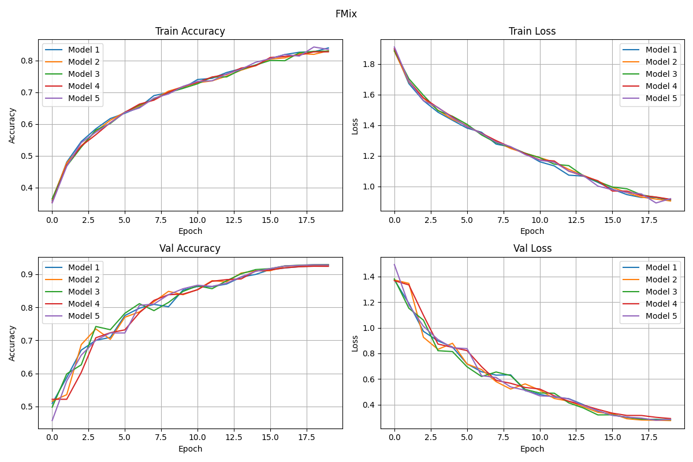
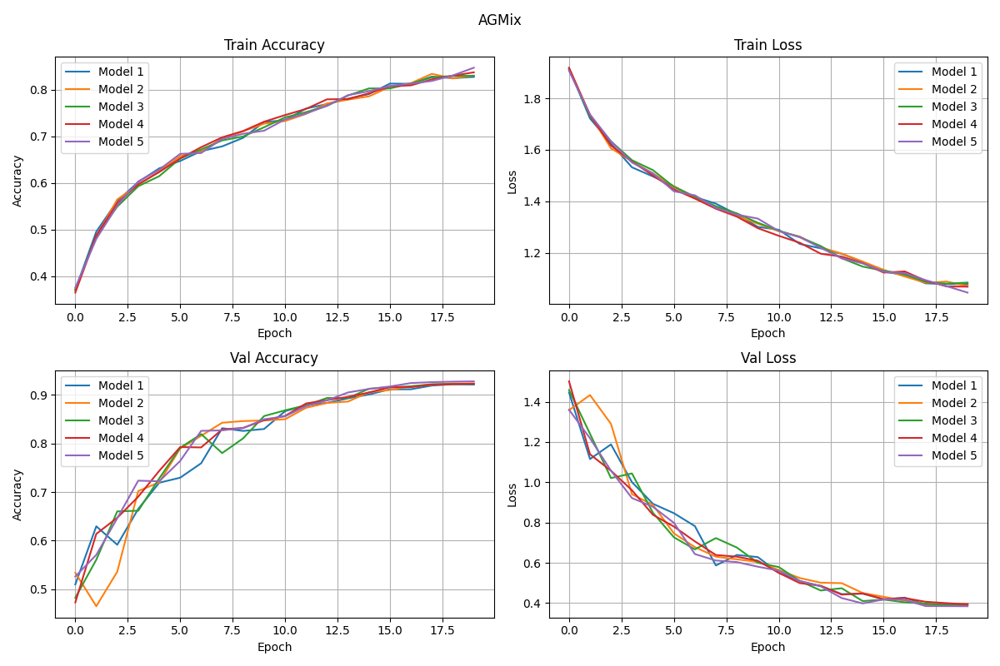

# Impact of Augmentation on Generalization

In this repository, I investigate the impact of various data augmentation techniques — **MixUp**, **FMix**, and **AGMix** (introduced in the *MiAMix* paper: https://arxiv.org/abs/2308.02804) — on improving the generalization capability of deep neural networks.  
All experiments were conducted on the **CIFAR-10** dataset.

The model used for evaluation is **ResNet-18**, trained with **5-fold cross-validation** for **20 epochs** per fold. The training pipeline includes the **1cycle policy** and **AdamW** optimizer.  
A custom implementation of **LRFinder** identified a peak learning rate of **1.5e-3**, which was used during training.

## Training Comparison

### Vanilla (No Augmentation)

### MixUp

### FMix

### AGMix

## Test Results (Across 5 Folds)

- **Vanilla**: *91.17 %*  
  (91.35 %, 91.37 %, 90.75 %, 91.07 %, 91.30 %)

- **MixUp**: *91.89 %*  
  (91.96 %, 91.95 %, 91.92 %, 91.96 %, 91.67 %)

- **FMix**: *92.18 %*  
  (92.45 %, 92.21 %, 91.92 %, 92.27 %, 92.07 %)

- **AGMix**: *91.88 %*  
  (91.72 %, 91.82 %, 91.86 %, 92.10 %, 91.90 %)

## Conclusion

The results clearly demonstrate that data augmentation techniques **enhance the generalization** of deep neural networks on CIFAR-10 compared to standard training. While all evaluated methods provided improvements, **FMix achieved the highest test accuracy**, showing the most consistent gains across all folds.  
This suggests that feature-level mixing strategies, such as FMix, can be particularly effective for improving robustness and generalization in image classification tasks.
