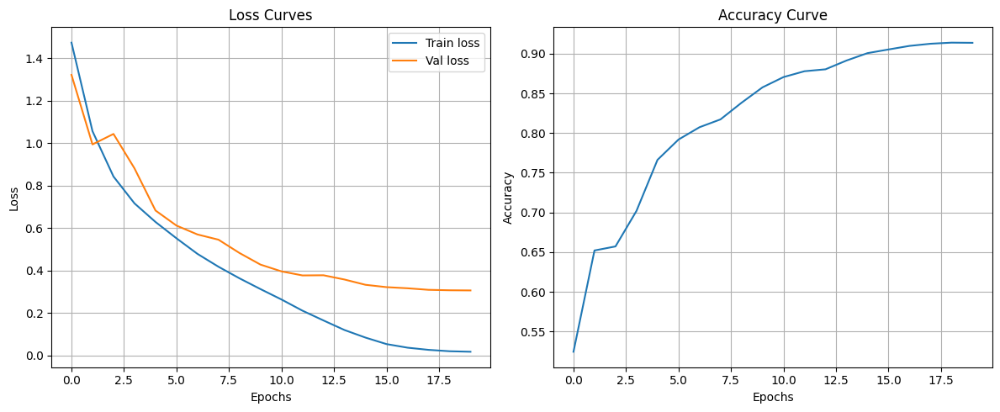
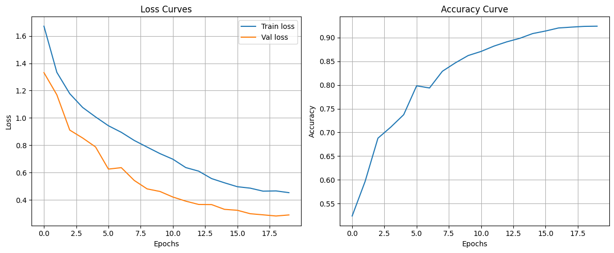
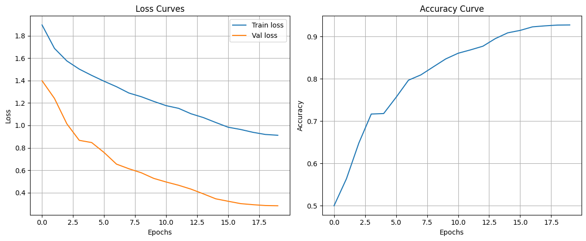
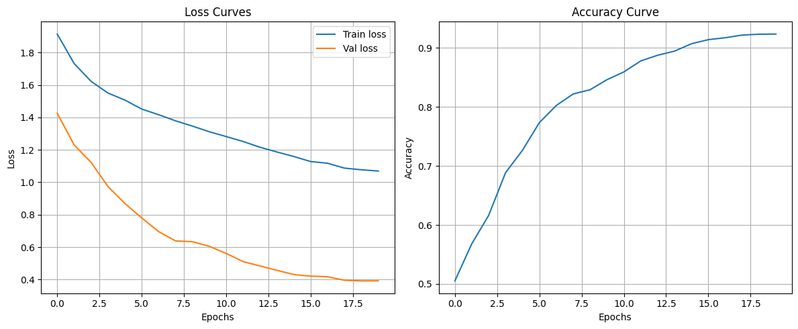

# Impact of Augmentation on Generalization

In this repository, I investigate the impact of various data augmentation techniques — **MixUp**, **FMix**, and **AGMix** (introduced in the **MiAMix** paper: https://arxiv.org/abs/2308.02804) — on improving the generalization capability of deep neural networks. All experiments were conducted on the **CIFAR-10** dataset.

The model used for evaluation is **ResNet-18**, trained with **5-fold cross-validation** for **20 epochs** per fold. The training pipeline includes the **1cycle policy** and **AdamW** optimizer. A custom implementation of **LRFinder** identified a peak learning rate of **1.5e-3**, which was used during training.

## Training Comparison

### Vanilla (No Augmentation)

### MixUp

### FMix

### AGMix

## Results

| Method | Mean | Fold 1 | Fold 2 | Fold 3 | Fold 4 | Fold 5 |
|:------:|:----:|:------:|:------:|:------:|:------:|:------:| 
| Vanilla | **91.17%** | 91.35% | 91.37% | 90.75% | 91.07% | 91.30% |
| MixUp | **91.89%** | 91.96% | 91.95% | 91.92% | 91.96% | 91.67% |
| FMix | **92.18%** | 92.45% | 92.21% | 91.92% | 92.27% | 92.07% |
| AGMix | **91.88%** | 91.72% | 91.82% | 91.86% | 92.10% | 91.90% |

## Conclusion

The results clearly demonstrate that data augmentation techniques **enhance the generalization** of deep neural networks on CIFAR-10 compared to standard training. While all evaluated methods provided improvements, **FMix achieved the highest test accuracy**, showing the most consistent gains across all folds. This suggests that feature-level mixing strategies, such as FMix, can be particularly effective for improving robustness and generalization in image classification tasks.

## Author

Created by [Denys Bondarchuk](https://github.com/thejvdev). Feel free to reach out or contribute to the project.
